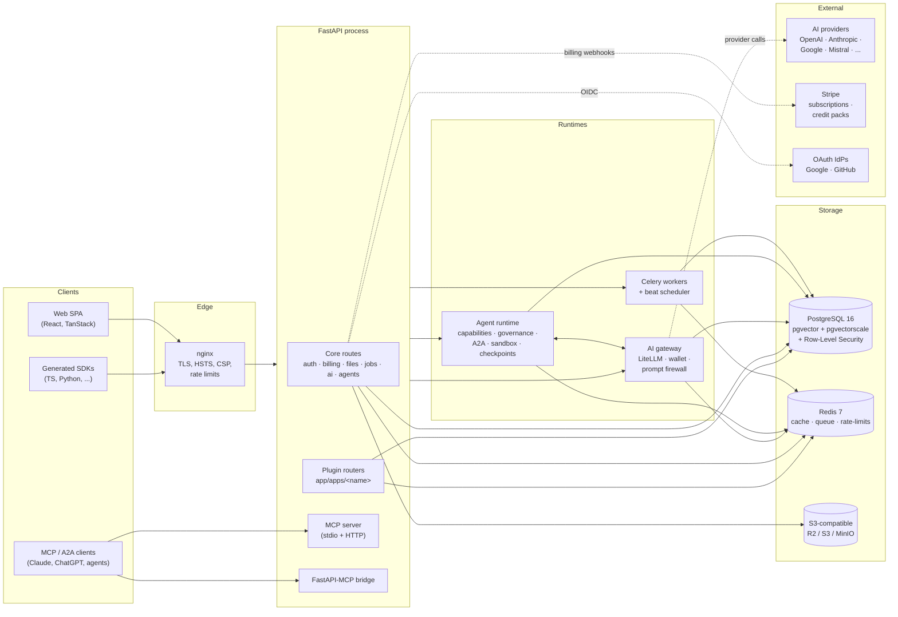

# Architecture

NEXUS is shaped as a **platform foundation + plugin contract**. The repository ships everything a real multi-tenant AI product needs out of the box, and your application code lives behind a small, opinionated interface so the platform can be upgraded without touching it.

This document is for developers who want the bird's-eye view before reading individual subsystems. For the day-to-day plugin author guide, see [`PLUGINS.md`](PLUGINS.md). For production deployment, see [`DEPLOY.md`](DEPLOY.md).

## System overview

## Request lifecycle

1. **nginx** terminates TLS, applies HSTS / CSP / framing headers, enforces global rate limits, and proxies to FastAPI.
2. **FastAPI** runs middleware in this order: request-id → structured logging → CSRF (double-submit cookie) → request-size cap → per-tenant rate limit (Redis) → auth (JWT / API key / session) → tenant context (`SET LOCAL app.tenant_id`).
3. Once the tenant context is set, every query executed on that session is filtered by PostgreSQL **Row-Level Security** policies under a non-superuser app role.
4. Route handlers dispatch to either:
   - **Core domain** (`app/api/v1/*`) — auth, billing, files, jobs, MCP routes, AI gateway, agents.
   - **Plugin domain** (`app/apps/<name>/api.py`) — routes contributed by your application.
5. Long-running work hands off to **Celery** via Redis. Worker tasks re-establish RLS context per task.

## Plugin contract surface

```mermaid
flowchart TB
    PluginBase["AppPluginBase<br/>(app/plugins/base.py)"]
    PluginBase --> Routers["get_routers() → FastAPI APIRouters"]
    PluginBase --> Models["get_models() → SQLAlchemy classes"]
    PluginBase --> MCPTools["get_mcp_tools() → MCP tools"]
    PluginBase --> AgentTools["get_agent_tool_definitions()<br/>+ invoke_tool()"]
    PluginBase --> Caps["get_capability_domains()"]
    PluginBase --> Celery["get_celery_config()"]
    PluginBase --> Scopes["get_scopes() → API-key scopes"]
    PluginBase --> Events["get_event_handler_modules()"]
    PluginBase --> Frontend["get_frontend_manifest() → nav, routes"]
    PluginBase --> Errors["get_error_handlers()"]
    PluginBase --> Lifecycle["on_startup() · on_shutdown() · health_check()"]
```

Discovery is automatic: dropping a `plugin.py` with a `PLUGIN = MyPlugin()` symbol under `app/apps/<name>/` makes the platform wire the plugin in on next boot. The reference plugin at [`app/apps/example/`](../app/apps/example/) exercises every hook in under 200 lines.

## Multi-tenancy model

- One PostgreSQL **schema** for the whole platform; tenants are rows.
- Every tenant-scoped table has a `tenant_id` column and a row-level security policy keyed off the session variable `app.tenant_id`.
- The application connects as a **non-superuser** role (`app_user`) that has `NOSUPERUSER NOBYPASSRLS`, so a bug that forgets to set the tenant context fails closed (no rows visible) instead of leaking cross-tenant data.
- CI runs a dedicated `RLS Tests (non-superuser)` job that re-runs the policy tests under that role to catch regressions that would silently pass under the bypass-RLS superuser.

## AI gateway

- LiteLLM under the hood — one HTTP surface for OpenAI, Anthropic, Google, Mistral, DeepSeek, Qwen, Aleph Alpha, and xAI.
- **BYOK**: tenants can supply their own provider keys; otherwise the platform's keys are used and consumption is billed against a credit wallet.
- **Wallet & metering**: every call records token counts, cached vs uncached, model, latency, and the dollar cost net of the configured margin.
- **Prompt firewall**: pluggable input/output guards (PII redaction, injection-pattern matching, configurable allow/deny topics).
- **Caching**: provider-side caching when supported (Anthropic) plus an optional Redis-backed semantic cache layer.

## Agent runtime

- Definition-driven: agents are rows in the database with capability bindings, governance policy, and tool allowlists.
- **Capabilities** are coarse-grained permissions (e.g. `crm.read`, `crm.write`) that resolve to a concrete set of allowed tools at invocation time.
- **Governance** enforces approval gates, spend caps, and per-action policy hooks before every tool call.
- **Tool registry** is plugin-extensible; the runtime threads `actor_user_id`, `agent_id`, and `agent_instance_id` through so connector tools can enforce confused-deputy prevention.
- **Sandboxing** is in-process today; the contract is shaped so it can be moved to a process or Firecracker boundary without changing the call sites.
- **A2A messaging**: agents can dispatch typed messages to other agents via Redis-backed queues with idempotency and dead-letter handling.
- **Checkpoints**: every run persists incremental progress; SSE streaming uses the same store so a dropped browser does not lose context.

## Observability

- Structured logs (`structlog`) with request-id and tenant-id correlation, plus dedicated log lines for every tool invocation, governance decision, and provider call.
- OpenTelemetry traces for FastAPI, SQLAlchemy, Redis, Celery, and outbound HTTP. OTLP exporter ships them to Jaeger by default.
- Prometheus metrics for request latency, queue depth, AI cost, and wallet balances.
- Health endpoints: `/api/v1/health/live` (process up), `/api/v1/health/ready` (DB + Redis + migrations + plugins).

## What's intentionally not in the core

The platform deliberately stops at the contract surface. The following live in plugins or downstream forks:

- CRM, billing portal, project management, knowledge bases — these are application concerns.
- LLM-specific prompts, evals, and reference data — they belong with the plugin that uses them.
- Customer-facing UI flows beyond the platform's authentication / billing / settings screens.

If you find yourself adding a concern to `app/core/` that only one application needs, push it back into the plugin.
